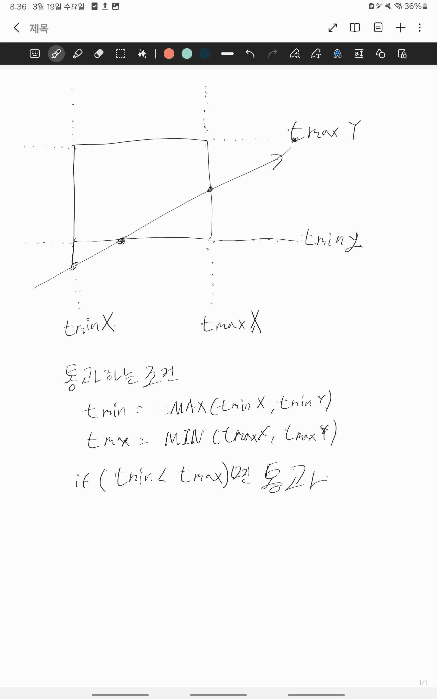
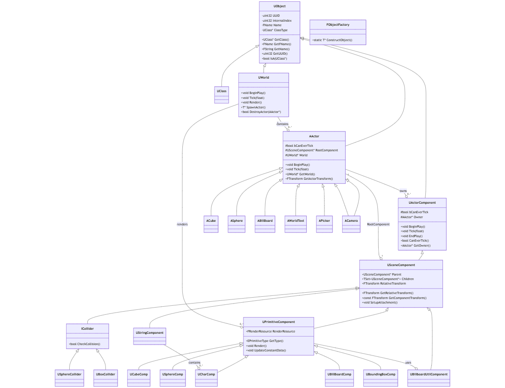
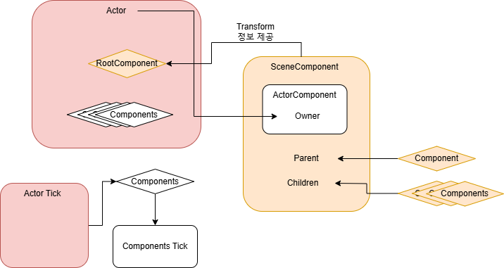
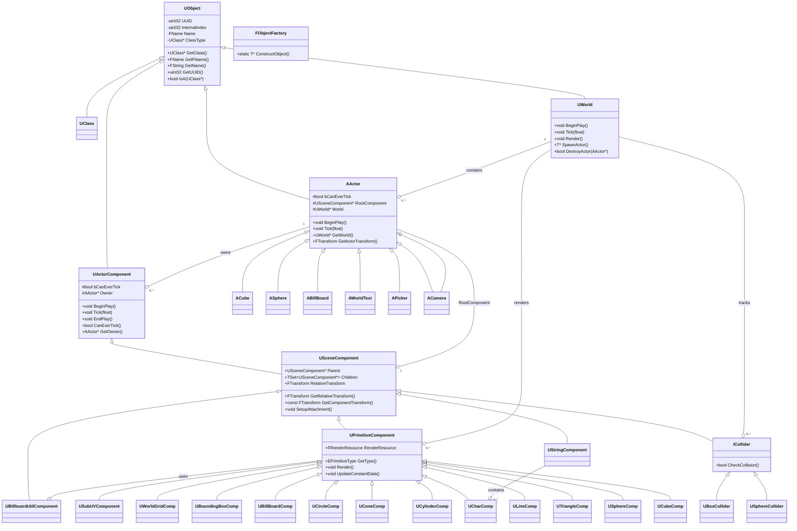
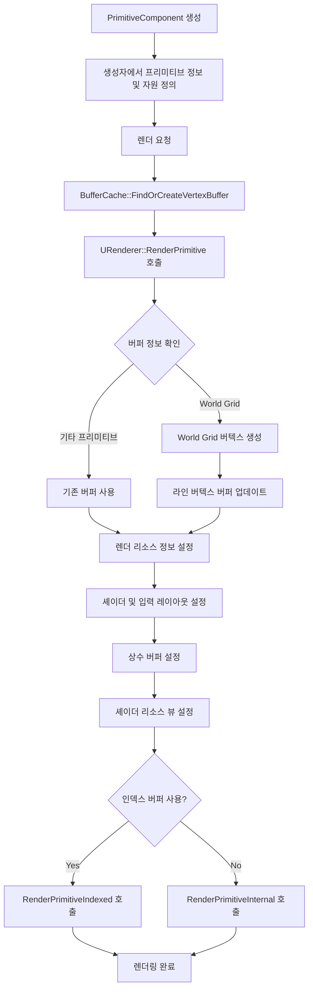

# W2 5팀 - 자료 정리

# 이론 내용 정리

### OBB

- 3개의 축에 대하여 align시킵니다. 한 축을 기준으로 해당 축의 min값에 도달하는 시간을 tmin, 해당축의 max에 걸치는 면에 도달하는 시간을 tmax라 정의합니다
    - 모든 축에 대하여 tmin < tmax일 때 물체를 통과했다고 판단할 수 있습니다.
    - 만약 한 축의 성분 (예를 들어 tminy > tmaxy)이 괄호의 조건을 만족한다면 광선의 x,z성분 물체안에 남아 있는 동안 y성분은 물체 밖으로 빠져나간 셈이므로, 충돌 조건을 성립하지 않습니다.
    - tmin이 음수인 경우는 ray를 반대 방향으로 쐈을 때 한 축의 min값으로 입니다.
        - 물체 안에서



### MVP 변환행렬


열벡터 기준


### 빌보드 변환

- 2가지 방법이 있습니다
    1. 카메라의 회전에 맞추어 빌보드의 정점을 회전해주는 방법 (Vertex Shader)
    2. 한 점을 4개의 점으로 확장시켜 정점의 위치를 바꿔주는 방식 (Geomtery Shader)
- 2가지 방법 모두 카메라의 회전에 따른 빌보드의 UpVector, Right vector를 구해줘야 합니다. 카메라가 보았을 때 언제나 맞은편에서 응시해야 하므로 UpVector는 카메라와 동일하고, ViewDirection은 반대입니다. Right Vector는 왼손 좌표계 기준으로 cross(UpVector, ViewDirection)입니다
- 기존의 x,y,z 좌표계에서의 회전행렬은 기저벡터의 순서가 right, up, forward(y가 up이므로) 였습니다
    - 하지만 언리얼 좌표축 기준으로 x가 forward, y가 right, z가 up입니다. 따라서 회전 행렬의 (정규화된)기저 벡터의 순서는 right, forward, up 순서입니다.
    - Note: roll이 언리얼에선 zy방향으로 회전(+), pitch는 xz방향으로 회전(말아오는 방향이 +), yaw는 xy방향으로 회전(+)

[https://chulin28ho.tistory.com/863](https://chulin28ho.tistory.com/863)

# 엔진기술서

---





### **1️⃣ 코어 오브젝트 시스템**

- **UObject** : 모든 객체의 기본 클래스, ID 및 타입 정보 관리, `UClass` 기반 RTTI 지원
- **UClass** : `UObject`의 메타데이터 저장 및 런타임 타입 정보(RTTI) 제공
- **FObjectFactory** : `UObject`의 메모리 할당 및 인스턴스 생성

### **2️⃣ 컴포넌트 시스템**

- **UActorComponent** : 액터에 부착 가능한 기본 컴포넌트 (`BeginPlay, Tick` 등 제공)
    - 액터에 부착 가능한 기본 컴포넌트
    - Transform이 없는, 실제 배치의 생성자, Update()를 관리합니다
- **USceneComponent** : 트랜스폼(위치, 회전, 크기) 관리, 계층적 트랜스폼 계산
    - 실제 배치되는, 트랜스폼을 가지는 컴포넌트
- **UPrimitiveComponent** : 렌더링 가능한 컴포넌트, 렌더 리소스 및 상태 관리
    - 렌더 기능 소유,

### **3️⃣ 콜라이더 시스템**

- **ICollider** : 충돌 감지를 위한 Collider들의 기본                               인터페이스
- **UBoxCollider, USphereCollider** : 박스/구 형태 충돌 감지
    - SceneComponent로 Actor에 부착되어 Actor에 충돌 판정을 더합니다.

### **4️⃣ 프리미티브 컴포넌트 (렌더링 요소)**

- **UCubeComp, USphereComp** : 3D 큐브/구 렌더링
- **UBillBoardComp** : 항상 카메라를 향하는 쿼드 렌더링
- **UBoundingBoxComp** : 와이어프레임 바운딩 박스 렌더링

### **5️⃣ 액터 시스템**

- **AActor** : 모든 씬 객체의 기본 클래스, 생명주기 관리 (`BeginPlay, Tick`)
    - 컴포넌트를 Add했다고 해서 Actor를 따라다니지는 않습니다
- **ACamera** : 원근/직교 투영 지원, 뷰 및 투영 행렬 제공
- **APicker** : 에디터에서 객체 선택 및 시각화
    - 선택된 액터에 UUID를 표시하는 WorldText와 BoundingBox를 부착해줌

### **6️⃣ 월드 관리**

- **UWorld** : 모든 액터 및 시스템을 포함하며 관리함, 씬 렌더링 및 충돌 조정, 직렬화 지원

---

### Note: 언리얼 엔진과 다른 점

UE5에는 FObjectFactory가 없음.

- UE5에서는 리플렉션 시스템 및 NewObject<T>(), StaticConstructObject_Internal() 등을 사용하여 객체를 생성

**UE5에서는 `BeginPlay, Tick, EndPlay`를 `UActorComponent`가 아닌 `AActor`에서 처리함.**

- `UActorComponent`는 `InitializeComponent()`와 `UninitializeComponent()` 등을 사용.
- **UE5에서는 `ICollider` 같은 명시적인 인터페이스가 없음.**
    - UE5의 충돌 시스템은 `UShapeComponent` 및 `UPrimitiveComponent`를 기반으로 구현됨.
- 충돌 감지는 `FPhysicsActorHandle`, `FBodyInstance` 등을 활용한 물리 시스템이 담당.
- 올바른 구조
    - `UShapeComponent` → `UBoxComponent`, `USphereComponent`
    - `UPrimitiveComponent` 기반 물리 처리 (`FBodyInstance` 활용)
    - `UStaticMeshComponent`: 3D 모델 렌더링
    - `UTextRenderComponent`: 3D 텍스트 렌더링
    - `UProceduralMeshComponent`: 커스텀 메시 생성

# 기술명세서

---

## Transform

### 로컬 회전


로컬 기즈모를 통해 로컬 회전축으로 오브젝트를 회전 시킬 수 있습니다.

```jsx
case EGizmoType::Rotate:
	AT.RotateRoll(Result.X); // 로컬 X 축을 기준으로 회전
	break;
	
	void RotateRoll(float Angle)  // 회전은 이렇게 계산 됩니다
{
	FVector Axis = FVector(1, 0, 0).GetSafeNormal();
	Rotation = FQuat::MultiplyQuaternions(FQuat::AxisAngleToQuaternion(Axis, Angle), Rotation);
}
	
	//특정 축을 기준으로 한 쿼터니언을 생성합니다
	FQuat FQuat::AxisAngleToQuaternion(const FVector& Axis, float AngleInDegrees) {
    float AngleInRadians = FMath::DegreesToRadians(AngleInDegrees);
    float HalfAngle = AngleInRadians * 0.5f;
    float s = sinf(HalfAngle);
    return FQuat(
        Axis.X * s,
        Axis.Y * s,
        Axis.Z * s,
        cosf(HalfAngle)
    );
}
FQuat FQuat::MultiplyQuaternions(const FQuat& q1, const FQuat& q2) {  //Q2 -> Q1 순서로 적용됩니다. )
    return FQuat(
        q1.W * q2.X + q1.X * q2.W + q1.Y * q2.Z - q1.Z * q2.Y, // X
        q1.W * q2.Y - q1.X * q2.Z + q1.Y * q2.W + q1.Z * q2.X, // Y
        q1.W * q2.Z + q1.X * q2.Y - q1.Y * q2.X + q1.Z * q2.W, // Z
        q1.W * q2.W - q1.X * q2.X - q1.Y * q2.Y - q1.Z * q2.Z  // W
    );
}

Q2->Q1 순서로 적용하면 회전 이후 로컬 X기준으로 회전합니다.

FVector GetLocalUp() const
{
	FMatrix RotationMatrix = FMatrix::GetRotateMatrix(Rotation);

	FVector up = FVector(
		RotationMatrix.M[0][2],  // 3 번째 열이 UP 벡터
		RotationMatrix.M[1][2],
		RotationMatrix.M[2][2]
	);

	return up.GetSafeNormal();
}
로컬 축 이동은 회전 행렬 에서의 각 축을 따와서 이동합니다.
```

### 월드기즈모


     항상 World Axis의 방향을 알려주는 월드 기즈모를 구성했습니다.

월드 기즈모는 항상 같은 방향을 향하고 있어 따로 변환 행렬을 적용해 주지는 않습니다.
 

```cpp
if (dynamic_cast<AWorldGizmo*>(GetOwner()) != nullptr) {
	ACamera* Camera = FEditorManager::Get().GetCamera();
	float ViewportSize = Camera->GetViewportSize();
	float Near = Camera->GetNear();
	float Far = Camera->GetFar();
	// 카메라의 오른쪽, Up 벡터 계산
	// 업데이트할 자료형들
	// 단순하게 NDC 상의 오프셋을 적용하는 방법 (행렬 순서에 주의)
	//FMatrix NDCOffset = FMatrix::GetTranslateMatrix(0.9,0.1,0);
	MVP = FMatrix::Transpose(FMatrix::OrthoForLH(ViewportSize, ViewportSize, Near, Far))
		* FMatrix::Transpose(Renderer->GetViewMatrix())
		* FMatrix::Transpose(WorldPosition);
	FVector delta = FVector(-0.8,-0.8,0);
	MVP.M[0][3] = delta.X;
	MVP.M[1][3] = delta.Y;
	MVP.M[2][3] = delta.Z;
}
월드 기즈모에 Orthgonal Matrix를 적용해 NDC의 고정된 방향에 생성합니다.
```

 **SubUV**

- 텍스트 아틀라스와 유사하게 매 프레임 마다 텍스처의 UV를 교환해 줍니다

### Show Flag

scene manager에서 show flag를 통해 렌더링 대상을 관리합니다

Show flag는 bitmask를 통해 관리하며 32비트의 uint32로 관리됩니다

```cpp
enum EShowFlag : unsigned int {
	Grid = 1 << 0,
	Primitive = 1 << 1,
	Text = 1 << 2,
	BoundingBox = 1 << 3,
};
// Show flag는 비트 마스크를 통해 관리합니다

//IMGUI
   uint32 showFlagMask = SceneManager.GetShowFlagMask();

   static const std::pair<const char*, EShowFlag> showFlagOptions[] = {
       {"Show Grid", EShowFlag::Grid},
       {"Show Primitive", EShowFlag::Primitive},
       {"Show Text", EShowFlag::Text},
       {"Show Bounding Box", EShowFlag::BoundingBox},
   };

   for (const auto& [label, flag] : showFlagOptions)
   {
       bool isEnabled = (showFlagMask & flag) != 0;
       if (ImGui::Checkbox(label, &isEnabled))
       {
           SceneManager.ToggleShowFlag(flag);
       }
   }
   
   void ToggleShowFlag(EShowFlag showFlag) { showFlagMasking ^= showFlag; } //XOR 연산은 통해 토글
//1과 XOR 하면 토글, 0과 XOR하면 그대로 1^0 = 1, 1^1=0 0^0=1  
```

### BillBoard

- 카메라가 회전한 만큼 빌보드 오브젝트를 반대로 돌려줍니다.

```cpp
// 카메라와 빌보드 위치 계산
ACamera* camera = FEditorManager::Get().GetCamera();
FVector billboardToEye = camera->GetActorTransform().GetPosition() - this->GetComponentTransform().GetPosition();
billboardToEye.Normalize();

// 카메라의 오른쪽, Up 벡터 계산
FVector upVector = camera->GetActorTransform().GetLocalUp(); upVector.Normalize();
FVector rightVector = FVector::CrossProduct(upVector, billboardToEye); rightVector.Normalize();
FVector adjustedUp = FVector::CrossProduct(billboardToEye, rightVector); adjustedUp.Normalize();

// 빌보드 회전 행렬 생성 (언리얼 좌표계 순서대로 적용, 정규화된 기저벡터)
FMatrix BillboardRotation = FMatrix(
	{ billboardToEye.X, billboardToEye.Y, billboardToEye.Z, 0.0f },
	{ rightVector.X,    rightVector.Y,    rightVector.Z,    0.0f },
	{ adjustedUp.X,     adjustedUp.Y,     adjustedUp.Z,     0.0f },
	{ 0.0f, 0.0f, 0.0f, 1.0f }
);

// 빌보드 위치를 고려한 최종 변환 행렬
FMatrix BillBoardTransform = BillboardRotation * this->GetComponentTransformMatrix();

// MVP 행렬 생성 (뷰 행렬을 Renderer에서 가져옴)
MVP = {
	.Model = BillBoardTransform,
	.View = Renderer->GetViewMatrix(),
	.Projection = Renderer->GetProjectionMatrix()
};

렌더 할때 카메라를 보도록 회전행렬을 만들어 적용합니다~ 축은 카메라의 Local Up을 기준으로 회전하도록 합니다. 
```

---

## **RTTI란?**

런타임 중에 해당 인스턴스의 현재 클래스와 부모 클래스를 알려주어

해당 클래스가 무엇인지, 어느 클래스와 상속관계를 가지고 있는지 알려줍니다.

예를 들어

다음과 같이 UObject를 AActor가 상속 받고, ASphere과 ACube가 AActor를 상속받는 구조라고 할 때


클래스 타입에 대한 비교는 다음과 같이 이루어집니다.

```cpp
ASphere SphereObject = ASphere();
SphereObject->IsA(UObject::StaticClass()); // true
SphereObject::GetClass() == UObject::StaticClass();  // false
SphereObject->IsA(AActor::StaticClass()); // true
SphereObject::GetClass() == AActor::StaticClass();  // false

SphereObject->IsA(ASphere::StaticClass());  // true
SphereObject::GetClass() == ASphere::StaticClass();  // true

SphereObject->IsA(ACube::StaticClass());   // false
SphereObject::GetClass() == ACube::StaticClass();    // false
```

### **어디에 활용되는가?**

해당 Instance가 어느 클래스인지 확인해야 하는 곳에서 활용됩니다.

예를 들어 다른 클래스로 이루어진 Instance들을 하나의 컨테이너에서 보관하고,

해당 컨테이너에 있는 요소들을 꺼내 작업을 시킬 때 (Update, Tick, Render 등)

특정 상황에는 특정 클래스에 다른 작업을 요청해야 할 때, RTTI를 활용하면 쉽고 빠르게 작업을 진행할 수 있습니다.


위의 코드는 ShowFlag에 따라서 RenderComponent의 요소들 중 Render하지 않을 요소들을 걸러내는 코드입니다.

RTTI를 사용해서 ShowFlag에 해당하는 요소인지 간편하고 빠르게 체크할 수 있었습니다.

### **어떻게 구현했는가?**

1. **필수적인 부분 ( 클래스 구분과 상속 구조 )**
2. **자동화 ( 매크로 활용 )**

### 필수적인 부분 ( 클래스 구분과 상속 구조 )

- UClass.h
    
    ```cpp
    #pragma once
    #include <string>
    #include "Object/UObject.h"
    
    class UClass : public UObject
    { 
    public:
    	UClass() { }
    	UClass(const char* InName, UClass* InParentClass);
    	~UClass();
    
    	UClass* GetParentClass() const { return ParentClass; }
    
    private:
    	UClass* ParentClass;
    
    public:
    	bool IsChildOf(const UClass* OtherClass) const;
    
    	template <typename T>
    		requires std::derived_from<T, UObject>
    	bool IsChildOf() const {
    		return IsA(T::StaticClass());
    	}
    
    };
    
    struct UClassDeleter
    {
    	void operator()(UClass* ClassPtr) const
    	{
    		ClassPtr->~UClass();
    		FPlatformMemory::DecrementObjectStats(sizeof(UClass));
    		StackAllocator::GetInstance().deleteNode(ClassPtr);
    	}
    };
    ```
    
- UClass.cpp
    
    ```cpp
    #include "UClass.h"
    #include <cassert>
    
    UClass::UClass(const char* InName, UClass* InParentClass)
    	: ParentClass(InParentClass) 
    { 
    	Name = InName;
    }
    
    UClass::~UClass() 
    {
    
    }
    
    bool UClass::IsChildOf(const UClass* OtherClass) const
    {
    	assert(this);
    	if (!OtherClass) return false;
    
    	if (this == OtherClass)
    	{
    		return true;
    	}
    
    	if (ParentClass != nullptr) 
    	{
    		return ParentClass->IsChildOf(OtherClass);
    	}
    	return false;
    }
    ```
    

위의 UClass 클래스에서 FName Name과 UClass* ParentClass 를 통해 

자신의 클래스 이름과 부모 클래스의 주소 값을 받아옵니다.

해당 UClass의 포인터를 UObject의 멤버 변수로 받게끔하여 UObject를 상속받는 클래스에서 UClass를 활용할 수 있도록 합니다.

- UObject.h
    
    ```cpp
    #pragma once
    #include <memory>
    
    #include "NameTypes.h"
    #include "Core/Container/String.h"
    #include "Core/HAL/PlatformType.h"
    
    class UClass;
    
    // TODO: RTTI 구현하면 enable_shared_from_this 제거
    class UObject : public std::enable_shared_from_this<UObject>
    {
    	friend class FObjectFactory; // 새 오브젝트 생성시 FName 변경 권한 위해 (UClass도 friend 필요 가능성)
    
    	uint32 UUID = 0;
    	uint32 InternalIndex = -1; // Index of GUObjectArray
    
    	/* Object의 Instance 이름 */
    	// TODO : UClass 및 RTTI 관련 세팅 : static 인스턴스 및 IsA 세팅, 매크로 연결, SceneManager상의 GUObjects의 인덱싱 갱신
    	friend class UClass;
    	
    	FName Name;
    	UClass* ClassType;
    
    public:
    	UObject();
    	virtual ~UObject();
    
    public:
    	static UClass* StaticClass();
    	UClass* GetClass() const { return ClassType; }
    
    public:
    	FName GetFName() const noexcept { return Name; }
    	FString GetName() const { return GetFName().ToString(); }
    
    	uint32 GetUUID() const { return UUID; }
    	uint32 GetInternalIndex() const { return InternalIndex; }
    
    public:
    	bool IsA(const UClass* OtherClass) const;
    
    	template<typename T>
    	bool IsA() const 
    	{
    		return IsA(T::StaticClass());
    	}
    };
    ```
    
- UObject.cpp
    
    ```cpp
    #include "UObject.h"
    #include "UClass.h"
    
    UObject::UObject()
    {
    	Name = "None";
    	ClassType = nullptr;
    }
    
    UObject::~UObject()
    {
    }
    
    UClass* UObject::StaticClass()
    {
    	static std::unique_ptr<UClass, UClassDeleter> StaticClassInfo = nullptr;
    	if (!StaticClassInfo)
    	{
    		constexpr size_t ClassSize = sizeof(UClass);
    		UClass* RawMemory = FPlatformMemory::Malloc<UClass, EAT_Object>(ClassSize);
    		UClass* ClassPtr = new(RawMemory) UClass("UObject", nullptr);
    		StaticClassInfo = std::unique_ptr<UClass, UClassDeleter>(ClassPtr, UClassDeleter{});
    	}
    	return StaticClassInfo.get();
    }
    
    bool UObject::IsA(const UClass* OtherClass) const
    {
    	const UClass* ThisClass = GetClass();
    	return ThisClass->IsChildOf(OtherClass);
    }
    
    ```
    

### 자동화 ( 매크로 활용 )

위와 같이 UObject가 UClass를 소유하고 있다고 해서 UObject를 상속받는 다른 클래스들까지 RTTI가 자동으로 적용되지는 않습니다.

다른 클래스에 RTTI를 적용하기 위해선 다른 클래스들 또한 

```cpp
UClass* UObject::StaticClass()
{
	static std::unique_ptr<UClass, UClassDeleter> StaticClassInfo = nullptr;
	if (!StaticClassInfo)
	{
		constexpr size_t ClassSize = sizeof(UClass);
		UClass* RawMemory = FPlatformMemory::Malloc<UClass, EAT_Object>(ClassSize);
		UClass* ClassPtr = new(RawMemory) UClass("AActor", UObject::StaticClass());
		StaticClassInfo = std::unique_ptr<UClass, UClassDeleter>(ClassPtr, UClassDeleter{});
	}
	return StaticClassInfo.get();
}
```

위와 같은 코드를 통해 자신의 클래스를 알려주는 UClass를 생성하고 자신의 ClassType에 보관해야 합니다. 

이를 모든 코드에 적용시키는 것은 매우 번거로운 일입니다.

따라서 다음과 같은 코드를 통해 각각의 클래스에 한줄의 매크로를 추가해주는 것으로 RTTI가 제대로 작동할 수 있도록 하였습니다.

- ObjectMacro.h
    
    ```cpp
    #pragma once
    #include <memory>
    #include "UClass.h"
    #include "Object/ObjectFactory.h"
    
    #define DECLARE_CLASS(TClass, TSuperClass) \
    public: \
    	using Super = TSuperClass; \
    	using ThisClass = TClass; \
    	inline static UClass* StaticClass() \
    	{ \
    		static std::unique_ptr<UClass, UClassDeleter> StaticClassInfo = nullptr; \
    		if (!StaticClassInfo) \
    		{ \
    			constexpr size_t ClassSize = sizeof(UClass); \
    			UClass* RawMemory = FPlatformMemory::Malloc<UClass, EAT_Object>(ClassSize); \
    			UClass* ClassPtr = new (RawMemory) UClass(#TClass, TSuperClass::StaticClass() ); \
    			StaticClassInfo = std::unique_ptr<UClass, UClassDeleter>(ClassPtr, UClassDeleter{}); \
    		} \
    		return StaticClassInfo.get(); \
    	} \
    ```
    

### 처음엔 생각하지 못했던 것들

RTTI를 구현하고자 했을 때 *‘각각의 클래스에 클래스를 정의하고 클래스간의 연결을 보여주는 요소를 만든다.’* 는 생각을 했기 때문에

Static 함수인 StaticClass() 를 통해 하나의 클래스에 하나씩 클래스 정보 보관 클래스를 할당하는 아이디어는 비교적 쉽게 떠올랐습니다.

다음 단계로 클래스 간의 상속 관계를 포인터로 표현해야했기에 저는 이들을 생성하고 관리해줄 UClassManager를 고안했습니다.

하지만 UClassManager로 이들을 관리하게 되면, 새로운 Class를 만들 때마다 UClassManager에서 해당 클래스의 UClass를 생성하는 코드를 추가해야 하고, 

사용하지 않을 클래스에 대해서도 UClassManager에서 매번 UClass를 만들어주는 단점이 있었습니다.

이 때문에 여러가지 고민을 해보았고 결국 형시우님의 코드에서 도움을 받아 다음과 같은 StaticClass 매크로를 구성하게 되었습니다.

- ObjectMacro.h
    
    ```cpp
    #pragma once
    #include <memory>
    #include "UClass.h"
    #include "Object/ObjectFactory.h"
    
    #define DECLARE_CLASS(TClass, TSuperClass) \
    public: \
    	using Super = TSuperClass; \
    	using ThisClass = TClass; \
    	inline static UClass* StaticClass() \
    	{ \
    		static std::unique_ptr<UClass, UClassDeleter> StaticClassInfo = nullptr; \
    		if (!StaticClassInfo) \
    		{ \
    			constexpr size_t ClassSize = sizeof(UClass); \
    			UClass* RawMemory = FPlatformMemory::Malloc<UClass, EAT_Object>(ClassSize); \
    			UClass* ClassPtr = new (RawMemory) UClass(#TClass, TSuperClass::StaticClass() ); \
    			StaticClassInfo = std::unique_ptr<UClass, UClassDeleter>(ClassPtr, UClassDeleter{}); \
    		} \
    		return StaticClassInfo.get(); \
    	} \
    ```
    

해당 코드는 unique_ptr을 활용하여 클래스당 하나의 StaticClassInfo를 만듭니다.

제가 생각하는 핵심 로직은 함수의 스택구조를 활용해서 자식 클래스에서 StaticClass()가 불리면 아직 StaticClassInfo가 없는 부모 클래스에서도 자동으로 StaticClassInfo가 동적 생성된다는 점입니다.

결국 Static 함수의 특징과 함수의 스택 구조를 제대로 활용하는 것이 이번 문제의 핵심이었다고 생각합니다.

추가적으로 UClassDeleter 부분을 통해 StaticClassInfo가 소멸될 때 어떤 작업을 할지 작성해둔 것도 배우게 되었습니다.

감사합니다.

### Texture 렌더링

1. TextureSampler를 만들어 줍니다.

```cpp

void URenderer::CreateTexturesSamplers()
{
    ComPtr<ID3D11SamplerState> SamplerState;
    D3D11_SAMPLER_DESC sampDesc;
    ZeroMemory(&sampDesc, sizeof(sampDesc));
    sampDesc.Filter = D3D11_FILTER_MIN_MAG_MIP_LINEAR;
    sampDesc.AddressU = D3D11_TEXTURE_ADDRESS_WRAP;
    sampDesc.AddressV = D3D11_TEXTURE_ADDRESS_WRAP;
    sampDesc.AddressW = D3D11_TEXTURE_ADDRESS_WRAP;
    sampDesc.ComparisonFunc = D3D11_COMPARISON_NEVER;
    sampDesc.MinLOD = 0;
    sampDesc.MaxLOD = D3D11_FLOAT32_MAX;

    Device->CreateSamplerState(&sampDesc, SamplerState.GetAddressOf());

    SamplerMap.insert({ 0, SamplerState });

    CreateTextureSRVW(L"Textures/box.jpg");
    CreateTextureSRVW(L"Textures/koverwatch.png");
    UAtlasInfo KoverwatchText = JsonSaveHelper::LoadAtlasInfo("koverwatch.png");
    UTextAtlasManager::AddAtlasInfo(KoverwatchText);

    CreateTextureSRVW(L"Textures/Faker.png");
    UAtlasInfo FakerSubUV = JsonSaveHelper::LoadAtlasInfo("Faker.png");
    USubUVManager::AddAtlasInfo(FakerSubUV);
}
```

1-1. 이미지 파일에서 

```cpp
void URenderer::CreateTextureSRVW(const WIDECHAR* filename)
{
    using namespace DirectX;

    ComPtr<ID3D11ShaderResourceView> SRV;
    ComPtr<ID3D11Texture2D> Texture; // Texture도 받아야 함

    auto hr = CreateWICTextureFromFile(Device, DeviceContext, filename, (ID3D11Resource**)Texture.GetAddressOf(), SRV.GetAddressOf());

    if (FAILED(hr))
    {
        UE_LOG("Failed to load texture");
        return;
    }
    assert(SRV.Get() != nullptr);
    // ShaderResourceViewMap에 추가
    uint32_t idx = ShaderResourceViewMap.size();
    ShaderResourceViewMap.insert({ idx, SRV });

    UE_LOG("Successfully loaded texture");
}
```

1. Texture Atlas 출력을 위한 Shader를 준비합니다.

```cpp
PS_INPUT mainVS(VS_INPUT input)
{
    PS_INPUT output;
    
    float2 uv = input.texcoord;
    uv.x = uv.x * atlasSize.x + atlasOffset.x;
    uv.y = uv.y * atlasSize.y + atlasOffset.y;
    output.texcoord = uv;
    
    output.position = mul(float4(input.position, 1.0f), MVP);
    
    
    return output;
}
```

위 코드에서는 atlasSize와 atlasOffset를 Vertex의 uv 좌표에 곱하고 더하여 Atlas 원본에서 원하는 부분만을 오브젝트에 입힙니다.

```cpp
float4 mainPS(PS_INPUT input) : SV_TARGET
{
    float2 uv = input.texcoord;
    float3 color = atlasTexture.Sample(atlasSampler, uv).rgb;
    float avg = (color.r + color.g + color.b) / 3.0f;
    clip(avg < 0.5f ? -1 : 1);
    return float4(color, 1.0f);
}
```

위 코드에서는 Sampler에서 Texture의 rgb 값을 받고 일정 이하로 어두운 경우 clip하여 그리지 않습니다.

- Text 관련 Component와 Actor
- Vertex Generating
    - Cone Vertex Index Generating
    - Spehre Vertex Index Generating

## 렌더링 구조 개선

- Primitive Component
    - RenderResource
        - VertexBuffer의 InputLayoutType, 토폴로지, 버텍스버퍼(또는 인덱스 버퍼)의 사이즈, 한 버텍스의 크기, 꺼내올 Shader와 상수버퍼의 Index, 인덱스 버퍼 사용여부를 가집니다
            - 텍스처를 사용하는 경우 optional로 인덱스들을 받습니다
        - 위 정보들은 PrimitiveComponent를 상속받는 클래스의 생성자에서 직접 정의되어, 가상함수 UpdateConstantData()에 쓰입니다
        
        ```cpp
        struct FRenderResource {
        	EPrimitiveType PrimitiveType;												// 최초 정의
        	InputLayoutType InputLayoutType = InputLayoutType::POSCOLOR;
        	D3D11_PRIMITIVE_TOPOLOGY Topology = D3D11_PRIMITIVE_TOPOLOGY_TRIANGLELIST;
        	uint32 numVertices = 0;					// Draw (numVertices, ...) 
        	uint32 Stride				   { 0 };
        	uint32 VertexShaderIndex       { 0 };
        	uint32 PixelShaderIndex        { 0 };
        	uint32 VertexConstantIndex     { 0 };
        	uint32 PixelConstantIndex      { 0 };
        	uint32 GeometryShaderIndex     { 0 };
        	bool bUseIndexBuffer			   { false };
        
        	std::optional<std::vector<uint32>> ShaderResourceViewIndices; // 다중 SRV [없을 수도 있음]
        };
        ```
        
- 상수 버퍼
    - ShaderParameterMacros.h
        - 모든 상수버퍼 구조체, Inputlayout 정보를 포함하는 헤더입니다. 아래는 상수버퍼를 선언하는 예시입니다. 아래 형태로 선언된 클래스는 PrimitiveComponent의 생성자와 URenderer의 상수버퍼를 생성함수에서 각각 형태를 정의하는 데에 쓰입니다.
            
            ```cpp
            BEGIN_GLOBAL_SHADER_PARAMETER_STRUCT(FLightConstants)
                SHADER_PARAMETER(FMatrix, Model)
                SHADER_PARAMETER(FMatrix, View)
                SHADER_PARAMETER(FMatrix, Projection)
                SHADER_PARAMETER(FMatrix, InvTranspose)
                SHADER_PARAMETER(FVector4, Color)
                SHADER_PARAMETER(uint32, bUseVertexColor)
                SHADER_PARAMETER(FVector, eyeWorldPos)
                SHADER_PARAMETER(FVector4, indexColor)
                SHADER_PARAMETER(uint32, bIsPicked)
                SHADER_PARAMETER(FVector, Padding)
            END_GLOBAL_SHADER_PARAMETER_STRUCT()
            ```
            
        
        ```cpp
        class UPrimitiveComponent 
        {
        public:
        	FRenderResource RenderResource;
        	FConstants ConstantData;
        	FLightConstants LightConstantData;
        }
        -----------------------------------------
        void URenderer::CreateConstantBuffer()
        {
            uint32 idx = CreateConstantBuffer<FConstants>();
        }
        ```
        
- URenderer의 역할
    - 렌더러는 모든 자원을 관리하며, key로 인덱스 또는 프리미티브 종류를, value로 자원을 가지는 map 자료구조입니다.
    - PrimitiveComponent로부터 렌더 요청을 받으면, 해당 컴포넌트의 자원정보에 따라 알맞게 맵핑합니다. 아래는 간략한 수도코드입니다.
        
        ```cpp
        void URenderer::RenderPrimitive(UPrimitiveComponent* PrimitiveComp, FRenderResource& RenderResource) {
            auto& [Type, ILType, Topology, numVertices, stride, VS, PS, VC, PC, GS, bUseIndexBuffer, SRVs] = RenderResource;
            
            // 월드 그리드 프리미티브의 경우, 버텍스 버퍼를 지속적으로 업데이트 시킵니다. 
            if (Type == EPrimitiveType::EPT_WORLDGRID) {
                auto [Vertices, Indices] = CreateWorldGrid();
                UpdateLineVertexBuffer(Vertices);
                SetTopologyAndBuffer(Type, Vertices);
            }
        
            SetRenderResource(RenderResource, Type);
        
            assertShaders(VS, PS, ILType, Type, bUseIndexBuffer);
            SetPipelineState(Topology, VS, PS);
            SetShaderResources(VC, PC, SRVs); // 텍스처를 사용한다면 SRV(들)을 바인딩합니다
        
            DeviceContext->IASetInputLayout(InputLayoutMap[ILType].Get());
            DeviceContext->IASetPrimitiveTopology(Topology);
        
            if (bUseIndexBuffer) {
                RenderPrimitiveIndexed(VertexBufferMap[Type].Get(), IndexBufferMap[Type].Get(), numVertices);
            } else {
                RenderPrimitiveInternal(VertexBufferMap[Type].Get(), numVertices);
            }
        }
        ```
        
- 한계점
    - 렌더러가 비대합니다. 자원 관리 주체를 ResourceManager와 같은 클래스 등으로의 분리가 필요합니다
    - 여러 텍스처를 사용하는 프리미티브의 SRV 인덱스를 저장하기 위한 공간이 필요합니다
- Batch Lining
    - 버텍스 관련 정보를 카메라의 위치 정보에 따라 지속적으로 CPU단에서 생성하고, 그리드와의 거리가 가까울수록 격자 크기가 커보이도록 했습니다. (”유니티”스러운 그리드를 만들어보려 한 의도입니다)

## FName

> `FName`은 **Unreal Engine에서 문자열을 효율적으로 관리하는 클래스(구조체)**로, 문자열을 직접 저장하지 않고 **테이블에 저장된 문자열의 인덱스만 저장**하는 방식으로 동작합니다.
> 

```cpp
struct FName
{
    int32 ComparisonIndex; // 비교연산을 최적화 하는 용도 (해시값)
    int32 DisplayIndex;    // 원본 문자열을 표시하는 용도 (고유한 문자열을 구분)
};
```

빠른 문자열을 비교하기 위해 정수로 변환한 값이 “ComparsionIndex”, 같은 이름이 여러 개 있을 때에 구분하기 위한 숫자가 “DisplayIndex”입니다. FName은 대소문자를 구별하지 않고, 효율적인 문자열을 비교하면서도 메모리 사용량을 아끼기 위해 쓰입니다.

```cpp
FName("StringTest) == FName("stringtest") // true
FName("Player1") == FName("Player2")      // false
FName("Player1") == FName("player1")      // true
```



```cpp
class UObject
{
    UINT UUID;
    FName Name;
};
```

언리얼에서는 UObject의 인스턴스별 독립된 UUID 정수, 그리고 문자열 정보를 담기 위한 FName을 멤버변수로 갖습니다. 만일, Cube라는 UObject를 여러 개 생성한다면, Cube_0, Cube_1, Cube_2가 차례대로 생성될 것입니다.  각 Cube(UObject)의 FName은 다르며, 원본 문자열을 담지 않고 정수만을 담습니다.

아래는 FName을 생성하는 흐름입니다.

```scss
FName("Player")  
  ├──> FNameStringView("Player")  // 문자열 저장
  │
  ├──> HashName<IgnoreCase>("Player")  // 해시 값 계산
  │      ├──> HashStringLower("Player")  // 소문자로 변환 후 해싱
  │      ├──> HashString("player")  // DJB2 해싱 수행
  │
  ├──> FNamePool::FindName("Player")  // 기존 FNameEntry 검색
  │      ├──> HashTable[Hash % Size] 확인
  │      ├──> 탐색 (없으면 nullptr 반환)
  │
  ├──> FNamePool::StoreName("Player")  // 새로운 엔트리 추가 (FindName 실패 시)
  │      ├──> FNameEntry 생성
  │      ├──> HashTable[Index]에 연결 (체이닝)
  │
  ├──> FName 객체가 ComparisonIndex 저장
```

- 즉, FName은 대소문자를 무시한 해싱 값을 가지고, 일련의 과정을 거쳐 FNamePool<uint32, FNameEntry*>에 접근합니다. 문자열 비교 없이 해싱 값으로 탐색 가능하니, O(1) 시간복잡도로 빠르게 액터를 찾을 수 있습니다.

원본 문자열은 FNameEntry 내의 union(공용체)에 ansichar 또는 widechar 배열로 담깁니다. 

```cpp
struct FNameEntry 
{
		FNameEntryId ComparsionId 
		FNameEntryHeader Header // 길이, wchar 여부를 담습니다.
}
```

원본 문자열을 찾고 싶다면 고유한 문자열의 해시값을 저장하는 DisplayIndex를 통해 NamePool을 탐색합니다. 대소문자 무시 등을 수반한 비교를 위한 해시 값은 ComparisonIndex를 이용합니다. 아래는 MakeFName 예시입니다.

- DisplayIndex는 원본 문자열을 저장하는 해시 값 (ToString(), 로그 출력 등)
    - ComparisonIndex는 비교를 위한 해시 값입니다. (operator ==, 검색, 비교 등을 수행)

```cpp
FindOrStoreString("Player")
  ├──> DisplayPool에서 기존 문자열 검색
  │      ├──> 존재하면 기존 해시 반환 (DisplayIndex 설정)
  │      ├──> 없으면 새로운 FNameEntry 생성
  │
  ├──> ComparisonPool에서 비교용 해시 검색
  │      ├──> 존재하면 그대로 사용
  │      ├──> 없으면 새로운 ComparisonIndex 생성
  │
  ├──> DisplayIndex와 ComparisonIndex 설정 후 반환
  ---------------------------------------------------
  // FName을 사용한 출력 예시 (현재는 *로 .c_str()을 수행합니다)
  sprintf_s(buffer, "%s(UUID: %d)", *actor->GetFName().ToString(), actor->GetUUID());
```

---

### UObject의 Instance 고유 이름

> UObject의 이름은 템플릿내 static 변수로 구현했습니다.
> 

 언리얼 엔진에서 Cube 10개를 생성할 때 중간의 Cube5 삭제 → 새로운 Cube 생성 → Cube5가 아닌 Cube11로 네이밍.. 이 되는 것을 관찰했습니다. RTTI로 구현한 모든 UObject를 상속받는 클래스는 자신의 클래스 정보(UClass*)를 가지므로, static 정수와 합쳐 네이밍했습니다.

```cpp

class FObjectFactory
{
public:
    /**
     * UObject를 생성합니다.
     * @tparam T UObject를 상속받은 클래스
     * @return 캐스팅된 UObject*
     */
    template<typename T>
        requires std::derived_from<T, UObject>
    static T* ConstructObject()
    {
		    /* ...중략 ... */
        static uint32 instanceID = 0;
        NewObject->Name = FName(ClassInfo->GetName() + "_" + FString::FromInt(instanceID++));
        auto tmp = NewObject->Name.ToString();
        NewObject->ClassType = ClassInfo;
        UEngine::Get().GObjects.Add(NewObject->GetUUID(), NewObject);
        return NewObject.get();
    }
};
```

- 이렇게 되면 UObject를 상속받는 모든 클래스별로, 컴파일 타임에 각각 다른 템플릿 함수가 생성되니 함수 내 static 변수의 위치도 다를 것이고, “클래스 별로 다른 instanceID”를 갖게 됩니다.

<aside>
💡

FName을 설계하는 데에 큰 도움이되는 조언을 아끼지 않은 형시우님께 감사드립니다.

</aside>

## 림 라이팅


- 림라이팅은 윤곽선을 그리는 데에 사용되었습니다. 물체 표면의 법선과 카메라로부터의 광선이 수직일수록 흰색을 더하는 원리인데, 자연스러운 밝기 변화를 위해 Hermit 보간(smoothstep)을 합니다.

```cpp
float rim = (1.0 - max(0.0, dot(normalWorld, toEye)));
rim = smoothstep(0.0, 1.0, rim);
rim = pow(abs(rim), 2.0f);
color += rim * float4(1.0f, 1.0, 1.0, 1.0) * rimPower;
```

- 이를 위해선 월드 공간에서의 카메라 좌표, 법선 벡터가 필요합니다. 벡터를 올바르게 월드 공간으로 변환하기 위한 과정은 다음 식으로 유도됩니다.

$$

(Au) \cdot n' = 0 \\ \text{내적 연산을 행렬로 표현} \\
(Au)^T n' = 0 \\ \text{행렬의 성질을 이용해서 전개하면} \\
u^T A^T n' = 0 \\ \text{즉 } A^T n' \text{이 } u \text{와 직교해야 함} \\ n' = (A^{-1})^T n \\\text{변환 행렬: } (A^{-1})^T = \begin{bmatrix}
1/s_x & 0 & 0 & 0 \\
0 & 1/s_y & 0 & 0 \\
0 & 0 & 1/s_z & 0 \\
? & ? & ? & 1
\end{bmatrix} \\ \text{◆ DirectX leak 현상 대처} \\
1. 4x4 행렬 마지막 열(translation)을 0으로 설정 \\
2. 원인: 역전치 시 생기는 잔류 변위값(? 부분) 제거 \\
3. 결과식: 

(A^{-1})^T_{\text{수정}} = \begin{bmatrix}
1/s_x & 0 & 0 & 0 \\
0 & 1/s_y & 0 & 0 \\
0 & 0 & 1/s_z & 0 \\
0 & 0 & 0 & 1
\end{bmatrix}
$$

- DirectX12 Luna 교재에 따르면 Translation값을 그대로 두면 새어나가(leak)는 문제가 있다고 합니다

> “the transposed translation in	the fourth column of (A−1)T “leaks” into the	product	matrix causing	errors. Hence, we zero out the translation as	a precaution to avoid this	error.” - DX12 3D 게임 프로그래밍 입문 p322 -
> 
- 이 때 역전치와 전치의 역행렬은 동치인 것은, Translation 성분을 0으로 만든 후의 SR 행렬에서 다음과 같이 확인할 수 있습니다.
    
    $$
    \text{행렬 특성} \\
    \begin{cases}
    \mathbf{S} = \begin{bmatrix}
    s_x & 0 & 0 \\
    0 & s_y & 0 \\
    0 & 0 & s_z
    \end{bmatrix} \Rightarrow \mathbf{S}^T = \mathbf{S} \\
    \mathbf{R}^T = \mathbf{R}^{-1} \quad (\text{회전행렬 직교성})
    \end{cases} \\ \text{▶ 역전치 행렬 증명 과정} \\
    (A^{-1})^T = (A^T)^{-1} \quad \text{// 기본 행렬 성질} \\ \text{양변 Transpose 적용 시} \\
    A^{-1} = [(A^T)^{-1}]^T \quad \text{// Transpose의 Transpose 소멸} \\ \text{구체적 전개} \\
    (SR)^{-1} = R^{-1}S^{-1} = R^T S^{-1} \\
    [(SR)^T]^{-1} = (R^T S^T)^{-1} = (R^T S)^{-1} = S^{-1} R \\ \text{▶ 양변 일치성 검증} \\
    R^T S^{-1} = S^{-1} R \quad \text{// } S^{-1}\text{는 대각행렬이므로 교환 가능} \\ \therefore (A^{-1})^T = (A^T)^{-1} \text{ 성립 확인}
    $$
    
- 그러므로 변환 행렬 A의 InvTranspose 행렬을 VertexShader로 넘겨주면, Vertex Shader는 모델의 월드 좌표와 노말의 월드 좌표 계산을 수행합니다.
    
    ```cpp
    // 각각 상수버퍼로 넘길 모델 변환 행렬, 변환 행렬 A의 InvTranspose입니다. 
    // HLSL은 행렬을 column-major로 읽기에 한번 더 전치시켜줬습니다.
    LightConstantData.Model = FMatrix::Transpose(MVP.Model);
    FMatrix modelWorld = MVP.Model;
    modelWorld.M[3][0] = modelWorld.M[3][1] = modelWorld.M[3][2] = 0;
    modelWorld = modelWorld.Inverse();
    // 한 번 더 전치
    FMatrix InvTranspose = FMatrix::Transpose(FMatrix::Transpose(modelWorld)); 
    ------------------------------------
    // 생략 {위의 두 행렬을 상수 버퍼로 받음} 
    PS_INPUT mainVS(VS_INPUT input)
    {
    	  position = mul(float4(input.position, 1.0f), Model);
        output.posWorld = position;
        output.normal = mul(float4(input.normal, 1.0f), InvTranspose);
    }
    ```
    

---

### 렌더 흐름도



## Raycasting

카메라의 위치에서 Ray를 발사

Ray의 방향은 NDC 기준으로 구한 화면 좌표를 Projection의 Inverse 한 것을 곱해서 WorldPosition을 구함

```cpp
FVector LocalOrigin = BoxRotation.Inverse().RotateVector(Origin - BoxCenter);
FVector LocalDirection = BoxRotation.Inverse().RotateVector(Direction);
```

```cpp
// HitResult(Raycasty 결과) 구조체 정의
struct FHitResult
{
    bool bBlockingHit;         // 충돌이 발생했는지 여부
    float distance;            // 충돌 지점까지의 거리
    FVector location;          // 충돌 발생 위치
    FVector normal;            // 충돌 표면의 법선 벡터
    UObject* hitObject;        // 충돌한 오브젝트
};
```

Ray의 위치와 방향을 OOB방식 혹은 구체와의 충돌 계산을 통해 물체 추적

```cpp
//Sphere와의 충돌 계산
// Ray 시작점에서 구체 중심까지의 벡터
FVector OriginToCenter = SphereCenter - Origin;

// 방향 벡터에 투영
float Projection = FVector::DotProduct(OriginToCenter, Direction);

// 구체 중심이 Ray의 반대 방향에 있고, Ray 시작점이 구체 밖에 있으면 충돌 없음
if (Projection < 0.0f && OriginToCenter.Length() > SphereRadius)
{
    return false;
}

// Ray 상에서 구체 중심에 가장 가까운 점 찾기
FVector ClosestPointOnRay = Origin + Direction * Projection;

// 가장 가까운 점에서 구체 중심까지의 거리 제곱
float Distance = (ClosestPointOnRay - SphereCenter).Length();

// 거리가 반지름보다 크면 충돌 없음
if (Distance > SphereRadius)
{
    return false;
}

// 교차점까지의 거리 계산
float DistanceToIntersection = Projection - FMath::Sqrt(SphereRadius * SphereRadius - Distance * Distance);

// 최대 거리 내에 있는지 확인
if (DistanceToIntersection > MaxDistance || DistanceToIntersection < 0.0f)
{
    return false;
}

return true;
```


```cpp
// 레이-박스 충돌 계산(OBB)
function RayBoxIntersection(Origin, Direction, BoxCenter, BoxExtent, BoxRotation, MaxDistance, OutHit):
    // 박스 로컬 공간으로 변환
    LocalOrigin = InverseRotate(BoxRotation, Origin - BoxCenter)
    LocalDirection = InverseRotate(BoxRotation, Direction)
    
    // 초기 t 범위 설정
    tMin = -INFINITY
    tMax = INFINITY
    
    // 각 축별 슬랩 테스트
    for axis in [X, Y, Z]:
        if |LocalDirection[axis]| < EPSILON:
            // 레이가 축과 평행할 경우
            if LocalOrigin[axis] < -BoxExtent[axis] OR LocalOrigin[axis] > BoxExtent[axis]:
                return false
        else:
            // 진입/탈출 t값 계산
            invDir = 1 / LocalDirection[axis]
            t1 = (-BoxExtent[axis] - LocalOrigin[axis]) * invDir
            t2 = (BoxExtent[axis] - LocalOrigin[axis]) * invDir
            
            // t1이 항상 작은 값이 되도록 정렬
            if t1 > t2:
                swap(t1, t2)
                
            // t 범위 업데이트
            tMin = max(tMin, t1)
            tMax = min(tMax, t2)
            
            // 충돌 불가능한 경우
            if tMin > tMax:
                return false
    
    // 충돌 거리가 유효한지 확인
    if tMin < 0:
        // 레이 시작점이 박스 내부에 있는 경우
        if tMax < 0:
            return false
        
        // 박스에서 나가는 지점 사용
        if tMax > MaxDistance:
            return false
        OutHit.distance = tMax
    else:
        // 박스에 들어가는 지점 사용
        if tMin > MaxDistance:
            return false
        OutHit.distance = tMin
    
    // 충돌 위치 계산
    OutHit.location = Origin + Direction * OutHit.distance
    
    return true
```

**Bounding Box**


**Scene Manager**


## 참고 자료 및 코드

https://chulin28ho.tistory.com/863