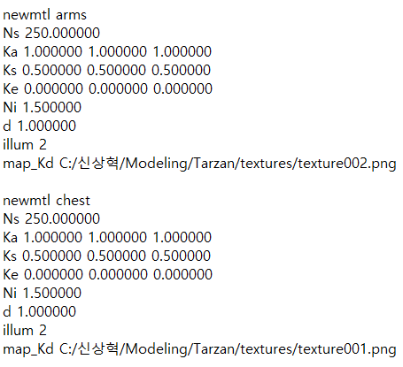

# Tarzan : 기술명세서

## Material

- 색상, 광택, 반사율, 법선, 투명도 등을 포함하여 모델 표면의 전반적인 모양을 정의하는 br개념
- 빛이 닿을 때 개체가 어떻게 보여야 하는지 알려준다.
- 일반적으로 맵이라고 하는 집합을 결합한다.

### MTL 파일 (.mtl)



- newmtl : 새로운 재질 선언
- Ka : 주변 반사율 (Ambient)
- Kd : 확산 색상 (Diffuse)
- Ks : 정반사율 (Specular)
- Ns : 반사 지수
- Ni : 표면 광학 밀도. 굴절률
- d : 투명도 (1: 불투명, 1미만: 투명도 적용). Tr : 1-d
- illum : 조명 모델 지정(1, 2, …10)
    
    ```
    0  -> 색상 표시, 주변광 꺼짐  
    1  -> 색상 표시, 주변광 켜짐  
    2  -> 하이라이트 켜짐  
    3  -> 반사 켜짐, 레이 트레이싱 켜짐  
    4  -> 투명도: 유리 효과 켜짐, 반사: 레이 트레이싱 켜짐  
    5  -> 반사: 프레넬 켜짐, 레이 트레이싱 켜짐  
    6  -> 투명도: 굴절 켜짐, 반사: 프레넬 꺼짐, 레이 트레이싱 켜짐  
    7  -> 투명도: 굴절 켜짐, 반사: 프레넬 켜짐, 레이 트레이싱 켜짐  
    8  -> 반사 켜짐, 레이 트레이싱 꺼짐  
    9  -> 투명도: 유리 효과 켜짐, 반사: 레이 트레이싱 꺼짐  
    10 -> 보이지 않는 표면에 그림자 생성
    ```
    
- map_Kd : diffuse_texture.png (Diffuse Map, Albedo)
→ 3D 모델 표면의 기본 색상을 담당하는 텍스처.
→ Pixel Shader에서 UV 좌표를 이용해 DiffuseMap.Sample(UV)로 텍셀을 가져옴.
→ Unlit Shader에서는 빛에 상관 없이 Albedo만을 그대로 보여줌
    
    DiffuseMap : 빛을 받아 난반사 된 색상 (전통적인 람버트 조명 모델에서의 용어(Phong))
    Albedo : 빛에 영향 없는 고유의 색상 (Base Color in UE) (PBR 에서의 용어)
    
    사실상 Diffuse Map을 빛에 영향을 안받도록 Shader에서 처리해 주면 Base Color가 된다.
    
- map_Ks : specular_texture.png
→ 빛 반사 정도(하이라이트)를 조절하는 맵.
→ 샘플링된 값(텍셀 값)이 Pixel Shader의 반사 계산에 활용됨.
- map_bumb : normal_texture.png
→ 법선(Normal) 정보를 저장한 맵으로, 실제로 기하학적으로 튀어나오거나 들어간 것처럼 보이게 함.
→ 샘플링된 Normal 값으로 조명 효과 계산.
- map_d : alpha_texture.png
→ 투명도를 결정하는 맵. Pixel Shader에서 샘플링 후 Alpha값으로 적용.

## Object 파일 (.obj)

---

```
v 0.0 0.0 0.0
v 1.0 0.0 0.0
v 1.0 1.0 0.0
vt 0.0 0.0
vt 1.0 0.0
vt 1.0 1.0
vn 0.0 0.0 1.0

f 1/1/1 2/2/1 3/3/1
```

- v : Vertex
- vt : Texture
- vn : Normal
- f : v index/vt index/vn index
    
    
    | 경우 | 표기 예시 |
    | --- | --- |
    | 위치만 | `f 1 2 3` |
    | 위치 + 텍스처 | `f 1/1 2/2 3/3` |
    | 위치 + 노멀 | `f 1//1 2//1 3//1` |
    | 위치 + 텍스처 + 노멀 | `f 1/1/1 2/2/1 3/3/1` |

## Lighting

## #. Phong Shading

- Diffuse, Specular, Ambient, Emissive 값을 계산


`Diffuse Color * (Diffuse Light + Specular Light + Ambient Light + Emissive Light)`

## 1. Ambient

```cpp
// Ambient 처리
float4 color = GlobalLight.Ambient * Material.Ambient;
ambientColor = DiffuseMap.Sample(sampler0, float2(uv.x, uv.y)) * color;
```

- 환경 광 → 원래는 주변에 어떤 물체가 있는 지에 따라 반사 되는 모든 빛을 계산해야하지만 복잡하고 성능상 좋지 않기 때문에 화면 전체의 밝기 정도로 처리한다.
- 위 코드에서는 GlobalLight와 Material이 가지고 있는 환경광 값을 이용

## 2. Diffuse

```cpp
// Diffuse 처리
float4 color = DiffuseMap.Sample(sampler0, float2(uv.x, uv.y));
float value = saturate(dot(-GlobalLight.Direction, normalize(normal))); // 음수 값 제거

float diffuseBoost = lerp(1.0f, 1.3f, 1 - Material.Roughness);

diffuseColor = color * value * GlobalLight.Diffuse * Material.Diffuse * diffuseBoost;
```

- 난반사 광 → 물체의 표면에서 빛이 반사하는 색. 표면이 빛을 향해 있을수록 더 밝게 보인다.
- GlobalLight와 Normal의 내적으로 빛을 얼마나 강하게 받는지 계산
- 음수 값을 제거해 줘야 빛을 안 받는 면이 완전 검정색으로 안나옴.

## 3. Specular

```cpp
 // Specular 처리
 float3 reflectionLight = GlobalLight.Direction - (2 * normal * dot(GlobalLight.Direction, normal));
 reflectionLight = normalize(reflectionLight);
 
 // 카메라 위치에서 세계 좌표까지의 방향 벡터
 float3 cameraPosition = CameraPosition - worldPosition;
 cameraPosition = normalize(cameraPosition);
 
 float value = saturate(dot(reflectionLight, cameraPosition));
 float shininess = lerp(64.0f, 1.0f, 1 - saturate(Material.Roughness));
 float specular = pow(value, shininess);
 
 specular *= lerp(1.0f, 0.1f, pow(1 - Material.Roughness, 2));
 
 specularColor = GlobalLight.Specular * Material.Specular * specular;
```

- 반사 광 → 표면의 반짝이는 특성을 표현하는 값
- 반사된 빛이 카메라로 입사하는 정도에 따라 처리

## 4. Emissive

```cpp
// Emissive 처리
float3 cameraPosition = normalize(CameraPosition - worldPosition);

float value = saturate(dot(cameraPosition, normal));
float emissive = 1.f - value;

emissive = smoothstep(0.0f, 1.0f, emissive);
emissive = pow(emissive, 2);

emissiveColor = float4(GlobalLight.Emissive * Material.Emissive * emissive, 1.0f);
```

- 자체 발 광 → 물체 자체에서 빛을 내는 현상을 표현. 외부 빛의 영향을 받지 않고, 오로지 물체 자체의 발광 특성에 의해 결정.

## Material - Note

## 언리얼에서는 어떻게?

> Material들은 `UMaterialInterface` 를 상속
> 
- `UMaterialInterface` 를 포함하는 `FStaticMaterial`들의 배열을 `UStaticMesh` 가 들고 있다
- 머티리얼을 런타임에 수정하거나 에디터에서 수정하기 때문에 MaterialInstance가 따로 있음

## 플젝에 적용

> Obj로드 시 머티리얼도 임포트, UMaterial을 만들어주자
> 
- FMaterial
    - 지금 있는 FObjMaterialnfo
- UMaterial
    - UObject 상속 Material클래스
    - TObjectIterator를 사용할 수 있게 된다

### 머티리얼 로드

- obj로딩하는 일련의 과정에서 머티리얼을 로드한다
    - FMaterial을 생성함
    - FObjManager::LoadMaterial
        - LoadMTL과정이 종료되면 호출됨
        - ObjImporter의 MaterialsPerGroup을 순회하면서 FObjectManager에 올려준다
            - 참조가아니라 복사해줘야 함
            - 여기서 FMaterial을 파라미터로 받아서 UMaterial로의 변환과정이 필요함
            - 이렇게 하면 다른쪽에서는 TObjectIterator를 통해 머티리얼에 접근 가능
- UStaticMesh의 FStaticMesh가 가지는 원본 머티리얼의 데이터는 그대로 보존
- UMaterialInstance를 만들어서 관리하자
    - 로드가 완료되는 시점에서 TMap<FString, UMaterial>에 UMaterial이 추가된다
    - 이제 어떤 머티리얼을 가져오고 싶으면, UMaterialInstance를 요청할 수 있음
        - 요청받는건 unique_ptr로 참조가 사라지면 메모리 해제하도록 함
    - `UMaterialInstance`:  UMaterial의 데이터를 카피떠서 만든 인스턴스
        - 이걸 StaticMeshComponent에서 사용한다
        - 런타임에 이 값을 만지면 변경되어 렌더링에 적용된다
        - StaticMeshComponent에서 SetMesh해주는 시점에 머티리얼들의 UMaterialInstance를 요청한다.
        - StaticMeshComponent에서 자신의 MaterialInstance를 변경할 수 있도록 뚫어두기
        - 렌더링 할 때도 이 인스턴스의 참조 넘겨줘서 쉐이더에서 적용할 수 있도록

# Scene

- 현재 월드의 상태를 저장
- 지금은 그냥 json으로 객체 뺀 다음 불러올 때 객체 다시 Instantiate하는 중
- 현재 씬의 액터의 모든 컴포넌트들을 순회하며 각 컴포넌트들의 상태를 다 저장해야 함
    - 각 컴포넌트들이 전부 Serialized되어야 함
    - Actor, ActorComponent, SceneComponent, PrimitiveComponent, StaticMeshComponent
        - FStaticMesh
    - Transform, Quaternion, Vector, Vector4, Vector2D

# FArchive

- 객체의 Serialize, Deserialize 담당
- std::stringstream을 기반으로 문자열을 stream, binary
- 사용자 정의 자료형 T에 대해 Serialize, Deserialize함수를 구현하여 클래스 자신의 직렬화, 역직렬화 로직 구현
- << 및 >> 연산자 오버로딩하여 fundamental 타입 또는 stl 컨테이너 타입에 대한 << 및 >> 연산자 호출
    
    ```cpp
    	void Serialize(FArchive& ar)
    	{
    		ar << X << Y << Z << W;
    	}
    
    	void Deserialize(FArchive& ar)
    	{
    		ar >> X >> Y >> Z >> W;
    	}
    ```
    
    - FVector4의 Serialize 및 Deserialize
    - x,y,z,w는 fundamental 타입이기 때문에 다음의 연산자가 호출됨
        
        ```cpp
        template <typename T>
        typename std::enable_if_t<std::is_fundamental_v<T>, FArchive&> operator<<(const T& Value)
        {
        	Stream.write(reinterpret_cast<const char*>(&Value), sizeof(T));
        	return *this;
        }
        
        template<typename T>
        typename std::enable_if_t<std::is_fundamental_v<T>, FArchive&>operator>>(T& Value)
        {
        	Stream.read(reinterpret_cast<char*>(&Value), sizeof(T));
        	return *this;
        }
        ```
        
- 현재 스트림의 데이터를 Binary로 출력하고, Binary타입의 std::string을 받아서 다시 로드하는 함수 `SaveToString` 과 `LoadFromBinary` 존재

### LoadAndConstruct

- UObject, Actor, ActorComponent들은 특정 함수를 통과해야 수명관리가 이루어짐

### Serialize 대상

- FVector(FVector4, 2D 포함)
- FString
- FName
- Actor
    - 액터는 가지고있는 Component들에 대해 Serialize, Deserialize해주면된다
    - 가지고 있는 컴포넌트들에 대해서 LoadAndConstruct를 해줘야 하고(AddComponent)
    - 액터 자기 자신은 월드에 SpawnActor되어야 한다
        - 플로우
            - 씬 로드
            - 액터 바이너리 만남
            - 액터를 LoadAndConstruct
                - 컴포넌트들을 LoadAndConstruct
                - 씬에 자신을 등록

# World 직렬화/역직렬화

> 씬의 현재 상태를 Save/Load
> 
- World의 직렬화/역직렬화 로직을 구현
    - Serialize
        - 월드는 Actor들을 들고있다
        - 월드에 존재하는 Actor들에 대해 FActorInfo를 다 뽑아내서 이 정보를 직렬화
    - Deserialize
        - 월드를 역직렬화 하면 `FActorInfo`의 배열을 얻을 수 있음
        - 이 배열을 순회하면서 액터들을 생성한다
- Actor의 직렬화/역직렬화
    - Actor는 SpawnActor를 통과하여 월드에 등록되어야 함
    - SpawnActor → LoadAndConstruct 과정을 거친다
    - `FActorInfo`
        - 액터의 Type
        - 액터의 Transform
        - 액터가 소유하는 ActorComponent들의 정보의 집합 `TArray<FActorComponentInfo>`
    - 액터는 자신의 생성자에서 컴포넌트들을 전부 AddComponent하기 때문에, 해당 컴포넌트들의 정보를 씌워줘야 함
    - `FActorInfo` 를 통해 얻어온  `TArray<FActorComponentInfo>` 를 바탕으로 ActorComponent들에 대한 `LoadAndConstruct` 를 호출함
        - `FActorComponentInfo`
            - Name
            - Transform
            - `TArray<FString> Args`
    - Component들의 `LoadAndConstruct` 는 오버로딩되어 각 컴포넌트에 맞는 초기화 로직을 수행한다
        - `StaticMeshComponent`의 경우 `Args`  배열의 첫 요소를 스태틱 메시의 이름, 두 번째 요소부터 머티리얼들의 이름으로 사용한다
        - 이 정보들을 기반으로 스태틱 메시와 머티리얼을 Set한다

## Factory

- 어떤 파일을 Import하고, 그 파일을 독자 규격인 tasset으로 저장한다
- 대상은 obj파일

## 현재 Obj파일 임포트

- ObjImporter가 obj를 파싱한다
    - 다음의 그룹으로 나뉨
        - vertices, indices, uvs, faces, materials
- Meshbuilder가 objimporter가 가져온 정보를 FStaticMesh로 변환한다
    - 이와 동시에 Submesh도 구성함
- StaticMesh의 사용
    - FObjManager::LoadObjStaticMeshAsset함수를 통해 path에서 위의 과정을 거쳐 FStaticMesh를 쿠킹한다

## Obj임포트 리팩토링

- FStaticMesh의 Serialize를 구현한다
- FObjManager::LoadObjStaticMeshAsset의 로직을 변경한다
    - 기존 : Path에서 직접 쿠킹
    - 변경 : tasset파일을 읽어와(헤더를 읽어 해당 오브젝트로의 Deserialize 로직을 통해 구조체 생성)
- 그러면 쿠킹하는 것은 어디서?
    - UFactory::Import를 통해서 Obj를 읽어와 메시와 머티리얼 구성, 텍스쳐 파일을 Textures 폴더에 복사

## FFactory

- static 함수 CreateFactory를 통해 파라미터로 들어온 확장자에 맞는 Factory를 생성한다
    - “.obj”를 파라미터로 넘겨주면 FStaticMeshFactory의 unique_ptr를 반환한다
- FFactory를 상속받은 클래스는 자신의 Import를 구현해야 함
    - Import에선 헤더의 생성, 파일의 Serialize, Tasset으로의 저장을 진행해야 함

### FStaticMeshFactory

- Import
    - `ProcessObjFile` 을 진행
        - `FObjManager::LoadObjStaticMeshAsset`을 호출하여 `FStaticMesh` Cooked 데이터와 `FObjMaterialInfo` 의 배열을 얻어온다
            - 이 시점에 스태틱 메시와 머티리얼은 메모리에 떠있게 된다
            - 가져온 FStaticMesh를 tasset으로 시리얼라이즈하여 Asset/StaticMesh폴더에 저장한다
    - 가져온 머티리얼 정보의 배열을 통해 `ProcessMtlFile` 을 진행
        - 머티리얼들에 대해 `CopyTextureFile` 을 호출하여 참조중인 절대 경로에 존재하는 텍스쳐 파일을 Asset/Texture에 복사해 넣는다
        - 가져온 `FObjMaterialInfo` 를 Serialize하여 tasset형태로 저장한다

# SWindow, SSpliter

## 클래스 다이어그램



## 기능 설명

<aside>
💡

1️⃣ Horizontal Spliter = RootWindow는 자식으로 Vertical Spliter 또는 SWindow 자료형을 가지며, Vertical Spliter 또한 SWindow 자식을 가집니다.

2️⃣ 개개의 부모 Spliter는 자식 SWindow에 마우스/키 이벤트, 렌더 함수를 전달합니다. 또한 자신의 입력 이벤트에선 경계 영역에 대한 Hover, MouseDown을 제어합니다.

3️⃣ SViewportWindow 실제 렌더링될 영역을 정하는 클래스입니다.

각 SViewportWindow는 개개의 전체화면 상태(bIsAnyFullScreen)를 공유하여 단 하나만이 전체화면이 될 수 있습니다.

4️⃣ 에디터 종료 시 .engine.ini에 저장된 Spliter 분할 비율 정보는 실행 시 복원됩니다. 디폴트 값은 0.1입니다.

</aside>

## 주요 기능 관련 코드

- Viewport, Spliter들의 렌더 로직
    - RootWindow(HorizontalSpliter) → Vertical Spliter 2개 → SViewportWindow 4개 순으로 각각 자식 2개의 윈도우 렌더 함수를 호출합니다
    
    ```cpp
    if (World)
    {
    	World->Tick(DeltaTime);
        RootWindow->Render();
        RootWindow->UpdateLayout(); // 뷰포트의 해상도 업데이트 함수
        World->LateTick(DeltaTime);
    }
    ------------------------------------
    void SSplitter::Render()
    {
        Super::Render();
        if (SideLT) SideLT->Render();
        if (SideRB) SideRB->Render();
    }
    ```
    
    - SViewportWindow는 렌더 대상(bRenderable)일 때 씬을 렌더합니다.
        - 이 때, 어느 Viewport 중 전체화면인 것이 있으면 렌더하지 않습니다.
        
        ```cpp
        // SViewportWindow.h
        void Render() override 
        {
            // 내가 아닌 사촌들 중 하나가 fullscreen일 때에 렌더하지 않음
            if (bRenderable && (!bIsAnyFullScreen || bFullScreen)) {
                UpdateViewport();
                if (Camera) {
                    Camera->SetViewportSize(DXViewport.Width, DXViewport.Height);
                    FEditorManager::Get().SetCamera(this->Camera.get());
                }
                UEngine::Get().GetRenderer()->SetViewport(DXViewport);
                UEngine::Get().GetWorld()->Render();
                bRenderable = false;
            }
        }
        ```
        
- Viewport와 Spliter의 마우스/키 입력 이벤트 처리
    - Initial input : WndProc
        - RootWindow가 존재하고, 중복입력이 아닐 때에 이벤트 함수를 호출합니다
        
        ```cpp
        // UEngine::WndProc() 
        case WM_MOUSEMOVE:
        {
            int x = GET_X_LPARAM(lParam);
            int y = GET_Y_LPARAM(lParam);
            FPoint mousePos(static_cast<uint32>(x), static_cast<uint32>(y));
            if (EngineInstance.RootWindow)
                EngineInstance.RootWindow->OnMouseMove(mousePos);
            break;
        }
        ```
        
    - 각 Spliter는 드래그 가능한 경계에 대해 마우스 입력 처리합니다.
        - 다음은 Horizontal Spliter의 예입니다
            - 가운데, 수직 축, 기타 수평 축의 순으로 입력 우선순위를 두어 드래그 시작부터 마우스 변화량을 저장하고, 해당 저장값을 자식인 Vertical Spliter에 전달합니다.
            
            ```cpp
            void SSplitterH::OnMouseMove(const FPoint& MousePos)
            {
                SSplitter::OnMouseMove(MousePos);
                if (!bIsDragging) // 중앙, 수직, 단일 수평 축에 대한 아이콘 변경 (hover시)
                {
                    if (IsOverCenter(MousePos)) { ::SetCursor(LoadCursor(nullptr, IDC_SIZEALL)); }
                    else if (IsOverVerticalBorder(MousePos)) { ::SetCursor(LoadCursor(nullptr, IDC_SIZEWE)); }
                    else if (IsOverBorder(MousePos)) { ::SetCursor(LoadCursor(nullptr, IDC_SIZENS)); }
                }
                if (bIsDragging)
                {
                    int deltaY = static_cast<int>(MousePos.Y) - static_cast<int>(LastMousePos.Y);
                    float normalizedDeltaY = static_cast<float>(deltaY) / static_cast<float>(Rect.H - BorderThickness);
                    int deltaX = static_cast<int>(MousePos.X) - static_cast<int>(LastMousePos.X);
                    float normalizedDeltaX = static_cast<float>(deltaX) / static_cast<float>(Rect.W - BorderThickness);
                    if (bIsVerticalDrag) // Vertical 축 드래그 : 좌우 delta만 적용
                    {
                        TopSplitterV->OnDrag(normalizedDeltaX);
                        BottomSplitterV->SetSplitRatio(TopSplitterV->GetSplitRatio());
                    }
                    else if (bIsCenterDrag) // 중앙 드래그 시 상하좌우 조절
                    {
                        // 양쪽 vertical splitter의 SplitRatio를 동시에 조정
                        TopSplitterV->OnDrag(normalizedDeltaX);
                        BottomSplitterV->OnDrag(normalizedDeltaX);
                        OnDrag(normalizedDeltaY); // horizontal 드래그
                    }
                    else { OnDrag(normalizedDeltaY); }
                    LastMousePos = MousePos;
                }
            }
            ```
            
- Key 이벤트도 마찬가지로 자식들에 전달되어, 최종적으로 SViewportWindow에서 호출됩니다.
    
    ```cpp
    virtual void OnKeyDown(EKeyCode Key) override
    {
        if (!bHovered) { return; }
    
        if (Key == EKeyCode::F) {
            if (!bFullScreen && bIsAnyFullScreen) { return; }
            ToggleFullScreen();
        }
        else if (Key == EKeyCode::T) {
            CycleCamera();
        }
    }
    ```
    
- 렌더대상이 될 FEditor::SetCamera()외에도 현재 Hover 또는 선택된 카메라의 정보가 필요하여 SetInputCamera() 메소드를 추가했습니다. 해당 메소드는 Input 처리 또는 Raycasting 함수에서 호출되어 실제 조작할 뷰포트의 카메라 정보를 가져옵니다.
    
    ```cpp
    void FEditorManager::SetInputCamera(ACamera* NewInputCamera)
    {
        InputCamera = NewInputCamera;
    }
    // 아래는 입력 처리 함수 중 일부
    void APlayerController::HandleCameraMovement(float DeltaTime) {
        ACamera* Camera = FEditorManager::Get().GetInputCamera(); 
        float CamSpeed = Camera->CameraSpeed;
        // ... //
    }
    ```
    
- 언리얼 엔진 상과 같이 Orthogonal은 동일한 Offset을 가져야 하기 때문에 여러 카메라들이 Pivot을 클래스 내 static 변수로 공유합니다.
    
    ```cpp
    class ACamera : public AActor
    {
        inline static FVector Pivot = FVector::ZeroVector; // 모든 Orthogonal 카메라가 공유할 Pivot
    }
    // 해당 Pivot 정보는 입력 핸들러 함수 에서 수정되고, 각 OrthoCamera는
    // Pivot(Delta)를 Tick()에 반영합니다.
    // 입력 핸들링 함수 중 일부
    
    void APlayerController::HandleCameraMovement(float DeltaTime) {
        // 입력이 안 들어올 경우 
        if (APlayerInput::Get().IsPressedMouse(true) == false) {
            Camera->SetOrthoPivot(FVector::ZeroVector);
            return; 
        }
        // ... 원근 투영 카메라에 대한 처리 중략 ... //
        // Orthogonal 카메라는 이동만 허용 
        else if (Camera->GetProjectionMode() == ECameraProjectionMode::Orthographic)
        {
            FVector Delta = Camera->GetRight() * (DeltaPos.X * Camera->CameraSpeed * DeltaTime) + Camera->GetUp() * (-DeltaPos.Y * Camera->CameraSpeed * DeltaTime);
            FVector MoveDir = Camera->GetOrthoPivot() - Delta;
            Camera->SetOrthoPivot(-Delta);              // Orthogonal 카메라가 움직일 delta 벡터
            CameraTransform.Translate(MoveDir * DeltaTime * CamSpeed * 10.f);
            Camera->SetActorTransform(CameraTransform); 
            return;
        }
    }
    // AACamera::Tick() 중 일부   
    void ACamera::Tick(float DeltaTime)
    {
        if (this->ProjectionMode == ECameraProjectionMode::Orthographic)
        {
            FTransform CamTransform = GetActorTransform();
            FVector Dir = Pivot;
            CamTransform.Translate (Dir * DeltaTime * CameraSpeed * 10.f); 
            SetActorTransform(CamTransform);
        }
    }
    ```
    

## 호출 흐름도

### 3.1 렌더링 흐름

1. **RootWindow (보통 SSplitterH 인스턴스)**
    
    → Render() 호출
    
    → SSplitterH::Render() 내부에서 상속받은 SSplitter::Render() 호출
    
    → SSplitter::Render()는 자식(SideLT, SideRB)을 차례대로 Render() 호출
    
    → (SideLT, SideRB는 각각 SSplitterV 또는 SViewportWindow 인스턴스)
    

### 3.2 마우스 이벤트 흐름

1. **윈도우의 WndProc에서**
    
    → 마우스 이벤트를 RootWindow->OnMouseMove(), OnMouseDown(), OnMouseUp()으로 전파
    
2. **SSplitter (및 하위 클래스들)**
    
    → OnMouseMove() 호출 시, 자식들에게도 전파 (예: SSplitter::OnMouseMove() → SSplitterV, SViewportWindow)
    
3. **SSplitterH의 경우**
    
    → OnMouseDown()에서 먼저 내부 자식(TopSplitterV, BottomSplitterV)의 OnMouseDown() 호출
    
    → 중앙 또는 경계 영역에 따라 자신(bIsCenterDrag, bIsVerticalDrag)을 설정
    
    → OnMouseMove()에서 드래그 상태에 따라 자신 및 자식에게 OnDrag() 호출
    
4. **SViewportWindow**
    
    → OnMouseDown()에서 자신이 hover되면, 입력 대상 카메라를 설정
    
    → OnKeyDown()에서 F키, T키(또는 _1키) 이벤트에 따라 전체화면 전환 및 카메라 전환 기능 실행
    

### 3.3 키 이벤트 흐름

- WndProc에서 WM_KEYDOWN 발생
    
    → RootWindow->OnKeyDown() 호출
    
    → SSplitter, SSplitterH 등은 자식들에게 키 이벤트를 전파
    
    → 최종적으로 SViewportWindow에서 OnKeyDown() 처리 (전체화면 토글, 카메라 전환 등)
    

## 키 이벤트 흐름도



## 한계와 고찰

**한계** : 최대 4개 창 분할만을 고려한 이유

- 수직 축에 대한 동시 제어 때문입니다. 각 창들이 동적으로 분할될 때에 수직/수평 축의 통합 제어가 생각나지 않아 4개 창 분할 대신 동시 수직 경계 제어로 바꿨습니다.
1. 현재 최대 4개 창에 대한 분할만을 고려합니다.
    - 다중 창 분할에 대한 처리가 필요합니다.
        - 선택된 뷰포트의 자식을 생성하고, 합치는 로직을 추가해야합니다.
        - 그렇게 되면 RootWindow는 SWindow 자료형이어야 하고,  각 RootWindow의 뿌리 아래 모든 클래스들은 언제든지 Spliter를 자식으로 가질 수 있어야 합니다.

**고찰**

가장 많이 고민한 부분은 다음 2가지 입니다.

1. 창 분할 인자
    - 최대 N개 창에 대한 레이아웃 프리셋이 있다고 가정해봅니다.
        - SWindow가 완전 2진 트리로 연결되어 있을 때, 트리의 깊이는 최대 logN입니다. (Splitter의 깊이는 고려하지 않습니다)
    - 특정 창을 분할하는 순서를 강제합니다 (수직, 수평이 모두 가능한 경우 수평 분할을 강제한다고 가정해봅시다)
        - 창을 분할하는 경우의 수는 HV의 2비트 입니다. 각각 수평, 수직 분할 여부를 나타냅니다
        - Depth = 2일 때에 HVHV가 저장될 것입니다. 각각 RootWindow 자식 2개 Spliter에 전달될 인자입니다.
        - 그렇다면 4개 창 분할에 대한 정보는 100101로 나타낼 수 있습니다.
            - 수평으로 한 번 가른 후, 수직으로 각각 1번씩 분할하면 4분할됩니다.
    - 전달될 인자, 순회 순서(분할 순서 및 전위 순회 등)가 정해졌으니 특정 레이아웃의 분할 인자를 정적으로 결정할 수 있습니다.
        - 해당 인자들은 프리셋이 변경될 때마다 RootWindow에 전달됩니다
        - 각 RootWindow는 자신의 Depth, 순회 순서에 알맞은 비트를 꺼내와 HV 분할여부를 결정합니다.
            - 비트가 둘다 0이라면 자기 자신이 SViewportWindow입니다.
2. (동적 분할/병합 지원시) 병합될 창들에 대한 정보
    - 동적으로 병합될 때에, 2개의 창을 병합하고 싶은 경우를 고려해봤습니다
        - 각 창의 가장 가까운 부모를 기준으로 병합 = 최소 공통 조상

## ObjectIterator

- ConstructObject를 할 때, Engine의 GObjects에만 객체의 포인터를 넣는 것이 아니라, 동시에 HashTable에 Object의 UClass 정보들과 같이 넣습니다.
- 이를 통해 외부에서 TObjectArrange<T>를 호출하면 해당 HashTable에서 Object의 해싱된 정보를 기반으로 Iterator를 만들고 반환합니다.

```cpp
/**
 * 특정 타입의 UObject 인스턴스를 순회하기 위한 반복자 클래스입니다.
 *
 * @tparam T 순회할 UObject 타입 또는 그 파생 클래스
 */
template <typename T>
class TObjectIterator
{
public:
    enum EEndTagType : uint8
    {
        EndTag
    };

    /** Begin 생성자 */
    explicit TObjectIterator(bool bIncludeDerivedClasses = true)
        : Index(-1)
    {
        GetObjectsOfClass(T::StaticClass(), ObjectArray, bIncludeDerivedClasses);
        Advance();
    }

    /** End 생성자 */
    TObjectIterator(EEndTagType, const TObjectIterator& Begin)
        : Index(Begin.ObjectArray.Num())
    {
    }

    FORCEINLINE void operator++()
    {
        Advance();
    }

    FORCEINLINE T* operator* () const
    {
        return (T*)GetUObject();
    }

    FORCEINLINE T* operator-> () const
    {
        return (T*)GetUObject();
    }

    FORCEINLINE bool operator==(const TObjectIterator& Rhs) const { return Index == Rhs.Index; }
    FORCEINLINE bool operator!=(const TObjectIterator& Rhs) const { return Index != Rhs.Index; }

protected:
    UObject* GetUObject() const
    {
        return ObjectArray[Index];
    }

    bool Advance()
    {
        while (++Index < ObjectArray.Num())
        {
            if (GetUObject())
            {
                return true;
            }
        }
        return false;
    }

protected:
    /** Results from the GetObjectsOfClass query */
    TArray<UObject*> ObjectArray;
    int32 Index;
};

/**
 * 특정 타입의 UObject 인스턴스들을 순회할 수 있는 범위를 정의하는 구조체입니다.
 * 이 구조체는 range-based for 루프에서 사용될 수 있습니다.
 *
 * @tparam T 순회할 UObject 타입 또는 그 파생 클래스
 */
template <typename T>
struct TObjectRange
{
    TObjectRange(bool bIncludeDerivedClasses = true)
        : Begin(bIncludeDerivedClasses)
    {
    }

    friend TObjectIterator<T> begin(const TObjectRange& Range) { return Range.Begin; }
    friend TObjectIterator<T> end(const TObjectRange& Range) { return TObjectIterator<T>(TObjectIterator<T>::EndTag, Range.Begin); }

    TObjectIterator<T> Begin;
};

struct FUObjectHashTables
{
    static FUObjectHashTables& Get()
    {
        static FUObjectHashTables Singleton;
        return Singleton;
    }

    TMap<UClass*, TSet<UClass*>> ClassToChildListMap;
    TMap<UClass*, TSet<UObject*>> ClassToObjectListMap;
};
```

## 위젯 시스템 다이어그램


- SlateApplication : 입력처리, SlateRenderer와 연동
- FSceneView : 씬 정보 구성, 3D좌표계를 화면에 투영, 수학 및 렌더링
- SWidget : 최상위 추상 클래스로, Widget의 렌더링, 이벤트 처리, 부모 자식간 Widget 소유 추상화
    - SPanel : 자식들의 배치 관리, 어떤 식으로 배열할지 추상화
        - SSpliter : 할당된 공간을 자식 위젯 수 만큼 나눔, 상용자가 경계를 드래그해서 조절
    - SWindow : UI 창의 기하학정보, 창 변형 및 재배치, 창 상태 관리
    - SViewport : 실제 렌더링, I/O 처리, Viewport 사이즈와 Viewport Interface 소유
    - SEditorViewport : 에디터 전용 뷰포트, FSceneViewport/SViewport/FEditorViewportClient 소유
        - SLevelViewport : 렌더링, View Update, 입력 및 상호 작용 처리, 설정 저장 및 로드
- FRenderTarget : 실제 GPU와 소통하는 데 쓰이는 RenderTarget을 소유하는 객체(?)
    - FVeiwport : Viewport 핸들/위치/크기 조절, 입력 처리, 마우스/키보드 포커스, 마우스 캡쳐, 화면 프레임의 시작/끝, HitProxy로 픽킹 등을 추상화, FViewportClient 소유
        - FSceneViewport : FViewport의 추상 함수들 구현
- FViewportClient : Viewport의 동작과 입력 관리를 하는 Client 역할 추상화
    - FEditorViewportClient : 카메라 제어, 입력 처리, 뷰포트 위젯 연동
        - FLevelEditorViewportClient : FSceneView 생성 및 렌더링, 카메라 제어 및 뷰포트 제어, 입력 처리, 액터 배치(드래그 드롭)
- 주요 입력 처리 함수들
    
    ```cpp
    virtual FReply OnFocusReceived() = 0;
    virtual void OnFocusLost() = 0;
    virtual FReply OnKeyChar(const EKeyCode& InKeyCode) = 0;
    virtual FReply OnKeyDown(const EKeyCode& InKeyCode) = 0;
    virtual FReply OnKeyUp(const EKeyCode& InKeyCode) = 0;
    virtual FReply OnMouseButtonDown(EMouseButton InMouseButton, const FPointer& InPointer);
    virtual FReply OnMouseButtonUp(EMouseButton InMouseButton, const FPointer& InPointer);
    virtual FReply OnMouseMove(const FPointer& InPointer);
    virtual void OnMouseEnter(const FPointer& InPointer);
    virtual void OnMouseLeave(const FPointer& InPointer);
    virtual FReply OnMouseWheel(const FPointer& InPointer) = 0;
    virtual FCursorReply OnCursorQuery(const FPointer& InPointer) const;
    virtual std::optional<std::shared_ptr<SWidget>> OnMapCursor(const FCursorReply& CursorReply) const = 0;
    virtual FReply OnMouseButtonDoubleClick(const FPointer& InPointer);
    virtual FReply OnDragDetected(const FPointer& InPointer) = 0;
    virtual void OnDragEnter(const FPointer& InPointer) = 0;
    virtual void OnDragLeave(const FPointer& InPointer) = 0;
    virtual FReply OnDragOver(const FPointer& InPointer) = 0;
    virtual FReply OnDrop(const FPointer& InPointer) = 0;
    virtual void OnFinishedPointerInput() = 0;
    virtual void OnFinishedKeyInput() = 0;
    ```
    
- Tick마다 Geometry 계산
    
    ```cpp
    void SWidget::Tick(const FGeometry& InParentGeometry, float DeltaTime)
    {    
    	// 1. 자신의 LayoutTransform을 로컬 위치(LocalPosition)를 바탕으로 갱신합니다.
    	LayoutTransform = FSlateLayoutTransform(1.0f, LocalPosition);    
    	// 2. 부모 Geometry(InParentGeometry)를 사용해 자신(현재 위젯)의 Geometry를 계산합니다.
    	//    MakeChild를 사용하더라도, 이 호출 결과는 "현재 위젯(자신)"의 Geometry를 의미합니다.    
    	FGeometry NewMyGeometry = InParentGeometry.MakeChild(LocalSize, LayoutTransform, FSlateRenderTransform(), FVector2D(0.5f, 0.5f));        
    	// 3. 계산된 자신의 Geometry를 저장합니다.
    	MyGeometry = NewMyGeometry;
    	// 4. 자신의 Geometry(MyGeometry)를 부모 Geometry로 하여 자식 위젯들의 Tick을 호출합니다.    
    	for(auto& Child : Children)   
    	{       
    		Child->Tick(MyGeometry, DeltaTime);    
    	}
    }
    ```
    

## FGeometry

- 위젯의 레이아웃과 관련된 기하학적 정보를 캡슐화하는 객체
- 위젯이 화면에 어떻게 배치되고, 크기와 위치, 스케일 등이 어떻게 변환되는지를 나타내는 데이터 구조
- 주요 멤버 변수
    
    `public:`
    
    `FVector2D LocalSize;`
    
    `float AbsoluteScale;`
    
    `FVector2D AbsolutePosition;`
    
    `FVector2D LocalPosition;`
    
- 주요 함수
    - `inline static FGeometry MakeRoot(const FVector2D& InLocalSize, const FSlateLayoutTransform& InLayoutTransform);`
        - 주어진 LocalSize, Identity RenderTransform을 사용해서 이 Geometry의 상대적인 자식 Geometry를 생성
    - `FArrangedWidget MakeChild(const std::shared_ptr<SWidget>& ChildWidget, const FVector2D& InLocalSize, const FSlateLayoutTransform& LayoutTransform) const;`
        - 주어진 LocalSize와 레이아웃 변환을 사용해 이 Geometry에 상대적인 Geometry+위젯을 생성
    - `FVector2D AbsoluteToLocal(const FVector2D& AbsoluteCoordinate) const`
        - 절대 좌표(위젯 계층의 루트가 위치한 공간의 좌표)를 이 Geometry 로컬 공간으로 변환
    - `FVector2D LocalToAbsolute(const FVector2D& LocalCoordinate) const`
        - 로컬 좌표를 절대 좌표(위젯 계층의 루트가 위치한 공간의 좌표)로 변환